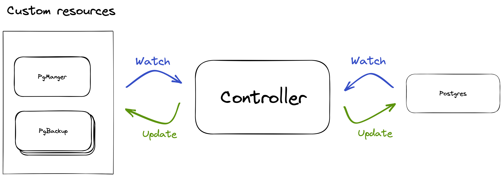

# Postgres backup management 

## Links
* Operator pattern - https://kubernetes.io/docs/concepts/extend-kubernetes/operator/
* Wal-g - https://wal-g.readthedocs.io

## Overview
Let's take a look at backup management for postgres using the kubernetes custom operator.

## Components 
* Controller
* Custom resource definitions
  * PgManager
  * PgBackup




## PgManager definition
```yaml
kind: PgManager
apiVersion: aidbox.pg/v01
metadata: {name: pg-manager, namespace: pgnamespace}
spec:
  selector: {name: postgres}
  backup: {numberToRetain: 30, at: '06:00:00'}
```

* `metadata.namespace` postgres namespace
* `spec.selector.name` name of pg `StatefulSet
* `spec.backup.at` - backup every day at *UTC
* `spec.backup.numberToRetain` - keep last *n* backups

At the specified time the controller creates a custom `pgbackup` resource and connects to the database that is specified in the `selector` field.

## Installation
* Deploy `aidboxops` controller with access to `kubernetes api` https://gist.github.com/artuaa/1771c2c5440b6836310991ea7e7bdee0.
* Deploy the custom `pgmanager` resource in the same namespace as the database.

## Introspection
You can use the standard kubernetes tools for introspection.

### Retrieving basic PgManager information
```
kubectl describe pgmanager -n mynamespace
```

```
Name: pg-manager
Kind: PgManager
Spec:
  ...
Status:
  Conditions:
    Backup:
      Log:
        Finish Time: 2022-01-02T06:06:16Z
        Name: pg-manager-backup-at-2022-01-02t06-00-14z
        Start Time: 2022-01-02T06:00:14Z
        State: success
      Status: ok
    Rotation:
      Log:
        Start Time: 2022-01-03T06:01:18Z
        State: success
        Finish Time: 2022-01-02T06:04:16Z
      Status: ok
    Storage:
      Message: ok
      State: available
      Status: ok
```
The `pgmanager` status stores a summary of the last few backups and the current tank connection status.

### Get detailed information about a specific backup
Getting a list of backups
```
kubectl get pgbackup -n prod --sort-by=.metadata.creationTimestamp
```
Get detailed information about a specific backup
```
kubectl describe pgbackup -n prod pg-manager-backup-at-2021-12-19t06-00-14z
```

```
Name: pg-manager-backup-at-2021-12-19t06-00-14z
Kind: PgBackup
Metadata:
  Creation Timestamp: 2021-12-19T06:00:14Z
  Generation: 1
Spec:
  Selector:
    Name: postgres
Status:
  Finish Time: 2021-12-19T06:04:16Z
  Message: Job finished in 4 seconds. 
  INFO: 2021/12/19 06:02:15.482416 Selecting the latest backup as the base for the current delta backup...
  INFO: 2021/12/19 06:02:15.502916 Calling pg_start_backup()
  INFO: 2021/12/19 06:02:15.572544 Starting a new tar bundle
  INFO: 2021/12/19 06:02:15.572575 Walking ...
  INFO: 2021/12/19 06:02:15.572720 Starting part 1 ...
  INFO: 2021/12/19 06:02:16.458000 Packing ...
  INFO: 2021/12/19 06:02:16.458407 Finished writing part 1.
  INFO: 2021/12/19 06:02:17.530148 Starting part 2 ...
  INFO: 2021/12/19 06:02:17.530196 /global/pg_control
  INFO: 2021/12/19 06:02:17.533378 Finished writing part 2.
  INFO: 2021/12/19 06:02:17.533939 Calling pg_stop_backup()
  INFO: 2021/12/19 06:02:18.559419 Starting part 3 ...
  INFO: 2021/12/19 06:02:18.564933 backup_label
  INFO: 2021/12/19 06:02:18.565018 tablespace_map
  INFO: 2021/12/19 06:02:18.565084 Finished writing part 3.
  INFO: 2021/12/19 06:02:19.572907 Wrote backup with name base_0000000100000000000020
  State: success
```

In the description of the `pgbackup` resource, you can see its status and logging `walg`.

## Errors and troublshoot

### NoPodAccess
* The `pgmanager` must be located in the same `namespace` as the database.
* The database must be described as `StatefulSet`.
* The name of the container must be `postgres`.

### AlreadyRunning
Crash occurs if backup process is already running. 
Can happen if you are running a backup process manually by creating a `PgBackup` resource while another backup is being executed.

### WalgError
Printed if the `walg` process failed.
The full log of `walg` can be found in the database pod.
You can connect to the database by using the command:
```
kubectl exec -it statefulset/<name> -n <namespace> -- bash
```

View logs:
``` sh
ls -la /PgBackup
cat /PgBackup/<name>.log
```

### InitializationError
Happens if the database is restarted during the backup process.
